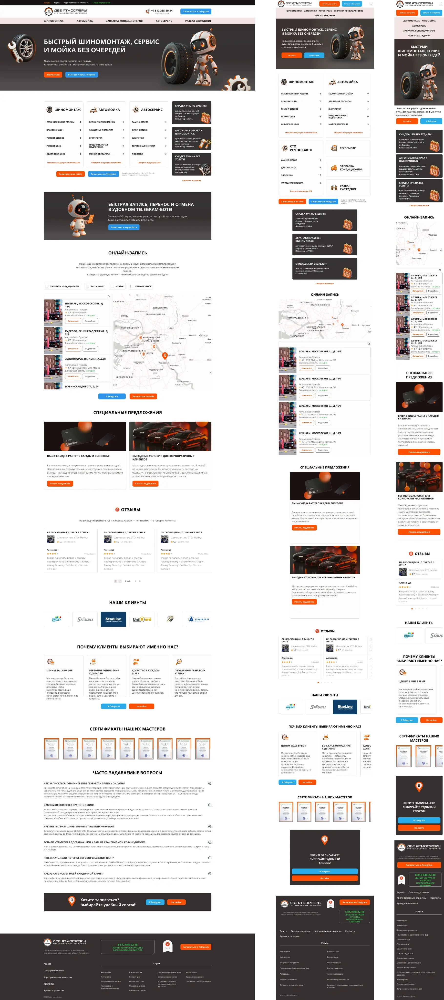

# $\color{darkorange}\textsf{2ATM}$

$\color{red}\textsf{Markup refactoring}$

## $\color{mediumblue}\text{Описание работы }$:

Клиентская часть многостраничного сайта

Вёрстка сайта с обновлённым дизайном [Две атмосферы](https://2atm.ru/)

**Цели и технические задачи работы :**

❗Вёрстка с минимальным использованием JS

❗Компонентная структура стилей для удобства переноса вёрстки в проект с Vue-3

🎯 $\color{mediumblue}\textsf{Основная задача}$ - Вёрстка страниц сайта по макету

---

Макет -> [**Figma**](https://www.figma.com/design/BBcBneC9aDAEz7ukF9pOFp/2atm--readme-version-?node-id=27-46&p=f&t=mVLySvOLKYKcmkGC-0)

Вёрстка -> [**Git pages**](https://artiom-work.github.io/2ATM/)

---

## $\color{mediumblue}\text{Технологии, инструменты и способы вёрстки }$:

✅ Sass
✅ БЭМ
✅ Flexbox
✅ CSS Grid
✅ Валидная вёрстка
✅ Адаптивная вёрстка
✅ Семантическая вёрстка
✅ Кросс-браузерная вёрстка
✅ Lazy-loading
✅ SVG Sprites
✅ Retina
✅ Pixel-perfect
✅ Git
✅ Figma
✅ VS Code
✅ Node.js
✅ Формы и валидация (HTML+CSS)
✅ Мобильное «бургер-меню» (HTML+CSS)
✅ Аккордеоны (HTML+CSS)
✅ Слайдеры (swiperJs)
✅ Hover/active-эффекты
✅ Анимации (CSS+JS)

---
