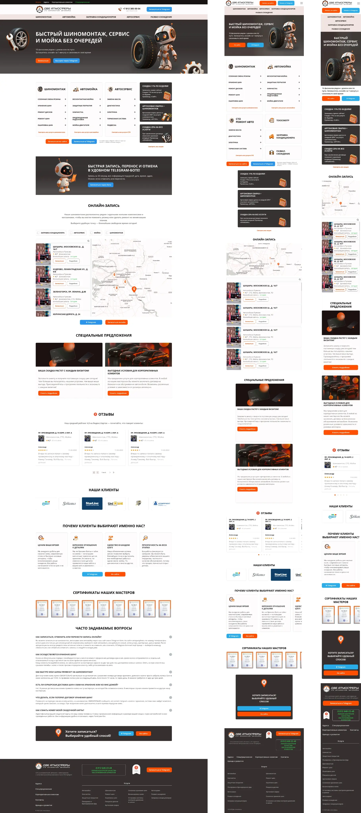

# $\color{darkorange}\textsf{2ATM}$

$\color{red}\textsf{Markup refactoring}$

## $\color{mediumblue}\text{Описание работы }$:

Вёрстка сайта с обновлённым дизайном [Две атмосферы](https://2atm.ru/)

**Цели и технические задачи работы :**

❗Вёрстка с минимальным использованием JS

❗Компонентная структура стилей для удобства переноса вёрстки в проект с Vue-3

❗Вёрстка процесса записи на услуги 2АТМ

❗Вёрстка внутренней части проекта 2АТМ ( _back office_ ) с использованием библиотеки Tailwind CSS

🎯 $\color{mediumblue}\textsf{Основная задача}$ - Вёрстка страниц сайта по макету

---

Макет ( _landing_ ) -> [**Figma**](https://www.figma.com/design/XGP736uQCO1X9UnfrrYTM1/2ATM--README-version-?node-id=27-46&p=f&t=urQf3VUhSMwAqGPm-0)

Макет ( _Процесс записи_ ) -> [**Figma**](https://www.figma.com/design/XGP736uQCO1X9UnfrrYTM1/2ATM--README-version-?node-id=2976-48590&p=f&t=urQf3VUhSMwAqGPm-0)

Макет ( _PitPos (back office)_ ) -> [**Figma**](https://www.figma.com/design/f3jAaHjWNeeq6SAEqD7ij1/PitPos--README-version-?node-id=0-1&p=f&t=qZuSDp9t2gjxNZoY-0)

Вёрстка (_landing_) -> [**Git pages**](https://artiom-work.github.io/2ATM/)

Вёрстка (_Процесс записи_) -> [**Git pages**](https://artiom-work.github.io/entry-2ATM/first.html)

Вёрстка ( _PitPos (back office)_ ) -> [**Git pages**](https://artiom-work.github.io/pit-pos/op-control-shifts.html)

---

## $\color{mediumblue}\text{Технологии, инструменты и способы вёрстки }$:

✅ Sass
✅ БЭМ
✅ Flexbox
✅ CSS Grid
✅ Валидная вёрстка
✅ Адаптивная вёрстка
✅ Семантическая вёрстка
✅ Кросс-браузерная вёрстка
✅ Lazy-loading
✅ SVG Sprites
✅ Retina
✅ Pixel-perfect( _частично_ )
✅ Git
✅ Figma
✅ VS Code
✅ Node.js
✅ Формы и валидация (HTML+CSS)
✅ Мобильное «бургер-меню» (HTML+CSS)
✅ Аккордеоны (HTML+CSS)
✅ Слайдеры (swiperJs)
✅ Hover/active-эффекты
✅ Анимации (CSS+JS)
✅ Tailwind CSS
✅ Preline (tailwind-library)

---

## $\color{orange}\text{ Список страниц 2АТМ ( landing ) }$:

1. [**Главная**](https://artiom-work.github.io/2ATM/)
2. [**Адреса**](https://artiom-work.github.io/2ATM/addresses.html)
3. [**Адреса ( _карточка_ )**](https://artiom-work.github.io/2ATM/addresses-card.html)
4. [**Корпоративным клиентам**](https://artiom-work.github.io/2ATM/corporate.html)
5. [**Спецпредложения**](https://artiom-work.github.io/2ATM/offers.html)
6. [**Спецпредложение**](https://artiom-work.github.io/2ATM/offer.html)
7. [**Аренда и развитие**](https://artiom-work.github.io/2ATM/rental-develop.html)
8. [**Контакты**](https://artiom-work.github.io/2ATM/contacts.html)
9. [**Программа лояльности**](https://artiom-work.github.io/2ATM/loyalty.html)
10. [**Услуги**](https://artiom-work.github.io/2ATM/services.html)
11. [**Услуга "Шиномонтаж"**](https://artiom-work.github.io/2ATM/tire-fitting.html)
12. [**Услуга "Балансировка"**](https://artiom-work.github.io/2ATM/balancing.html)
13. [**Услуга "Ремонт шин"**](https://artiom-work.github.io/2ATM/tire-repair.html)
14. [**Услуга "Сезонное хранение шин"**](https://artiom-work.github.io/2ATM/tire-storage.html)
15. [**Услуга "Ошиповка шин"**](https://artiom-work.github.io/2ATM/tire-studding.html)
16. [**Услуга "Покраска дисков"**](https://artiom-work.github.io/2ATM/disk-painting.html)
17. [**Услуга "Установка системы контроля давления в шинах"**](https://artiom-work.github.io/2ATM/tire-pms.html)
18. [**Услуга "Аргоновая сварка"**](https://artiom-work.github.io/2ATM/argon-welding.html)
19. [**Услуга "Водородная очистка двигателя"**](https://artiom-work.github.io/2ATM/h-engine-cleaning.html)
20. [**Услуга "Аппаратная раскоксовка двигателя"**](https://artiom-work.github.io/2ATM/decoking-engine.html)
21. [**Услуга "Автосервис"**](https://artiom-work.github.io/2ATM/car-service.html)
22. [**Услуга "Заправка кондиционера"**](https://artiom-work.github.io/2ATM/refill-conditioning.html)
23. [**Услуга "Развал-схождение"**](https://artiom-work.github.io/2ATM/wheel-alignment.html)
24. [**Услуга "Автомойка"**](https://artiom-work.github.io/2ATM/car-wash.html)
25. [**Услуга "Полировка и бронирование фар"**](https://artiom-work.github.io/2ATM/headlight-protection.html)
26. [**Услуга "Химчистка"**](https://artiom-work.github.io/2ATM/dry-cleaning.html)
27. [**Услуга "Защитные покрытия"**](https://artiom-work.github.io/2ATM/body-protection.html)
28. [**Страница 404**](https://artiom-work.github.io/2ATM/404-page.html)

## $\color{orange}\text{ Список страниц 2АТМ ( запись на услуги ) }$:

$\color{orange}\text{➡}$ [**Репозитоний**](https://github.com/Artiom-Work/entry-2ATM/blob/main/README.md)

1. [**Страница выбора записи**](https://artiom-work.github.io/entry-2ATM/first.html)
2. [**Страница выбора записи с блоком верификации с помощью кода**](https://artiom-work.github.io/entry-2ATM/check-enty-code.html)
3. [**Страница выбора услуг**](https://artiom-work.github.io/entry-2ATM/select-services.html)
4. [**Страница первого пути создания записи (шиномонтаж)**](https://artiom-work.github.io/entry-2ATM/first-way.html)
5. [**Страница первого пути создания записи (мойка)**](https://artiom-work.github.io/entry-2ATM/wash-way.html)
6. [**Страница последнего пути создания записи. Выбор места и времени услуг**](https://artiom-work.github.io/entry-2ATM/last-way.html)
7. [**Страница с итоговым чеком выбранных услуг**](https://artiom-work.github.io/entry-2ATM/success.html)
8. [**Страница с выбором(поиском) автомобиля**](https://artiom-work.github.io/entry-2ATM/choice-car.html)

## $\color{orange}\text{ Список страниц 2АТМ-PITPOS ( back office ) }$:

$\color{orange}\text{➡}$ [**Репозитоний**](https://github.com/Artiom-Work/pit-pos/blob/main/README.md)

1. [**Форма входа**](https://artiom-work.github.io/pit-pos/sign-in.html)
2. [**Смены (оперативный контроль)**](https://artiom-work.github.io/pit-pos/op-control-shifts.html)
3. [**Смена детально (оперативный контроль)**](https://artiom-work.github.io/pit-pos/op-control-shift-details.html)
4. [**Заказ-наряд**](https://artiom-work.github.io/pit-pos/op-control-work-order.html)
5. [**Сезонные хранения (оперативный контроль)**](https://artiom-work.github.io/pit-pos/op-control-seasonal-storage.html)
6. [**Заявки на выдачу сезонных хранений (оперативный контроль)**](https://artiom-work.github.io/pit-pos/op-control-storage-applications.html)
7. [**Заявка на выдачу сезонных хранений (оперативный контроль)**](https://artiom-work.github.io/pit-pos/op-control-application-storage-card.html)
8. [**Сезонные хранения детально (оперативный контроль)**](https://artiom-work.github.io/pit-pos/op-control-storage-card.html)
9. [**Покраска дисков (оперативный контроль)**](https://artiom-work.github.io/pit-pos/op-control-disks-painting.html)
10. [**Гарантии (оперативный контроль)**](https://artiom-work.github.io/pit-pos/op-control-guarantees.html)
11. [**Гарантия детально (оперативный контроль)**](https://artiom-work.github.io/pit-pos/op-control-guarantee.html)
12. [**Физлица (клиенты)**](https://artiom-work.github.io/pit-pos/clients-individuals.html)
13. [**Юр.лица (клиенты)**](https://artiom-work.github.io/pit-pos/clients-legals.html)
14. [**Карточка Юр.лица (клиенты)**](https://artiom-work.github.io/pit-pos/clients-legal-card.html)
15. [**Создание карточки Юр.лица (клиенты)**](https://artiom-work.github.io/pit-pos/clients-create-legal-card.html)
16. [**Добавления автомобиля к карточке клиента (клиенты/юрлица)**](https://artiom-work.github.io/pit-pos/clients-create-legal-car.html)
17. [**Просмотр автомобиля в карточке клиента (клиенты/юрлица)**](https://artiom-work.github.io/pit-pos/clients-legal-car.html)
18. [**Редактирование автомобиля в карточке клиента (клиенты/юрлица)**](https://artiom-work.github.io/pit-pos/clients-legal-car-edit.html)
19. [**Мастерские (Справочники)**](https://artiom-work.github.io/pit-pos/reference-workshops.html)
20. [**Мастерская (Справочники)**](https://artiom-work.github.io/pit-pos/reference-workshop.html)
21. [**Рекомендации (Справочники)**](https://artiom-work.github.io/pit-pos/reference-recommendations.html)
22. [**Роли (Справочники)**](https://artiom-work.github.io/pit-pos/reference-roles.html)
23. [**Мои компании (Справочники)**](https://artiom-work.github.io/pit-pos/reference-my-companies.html)
24. [**Промокоды (Лояльность)**](https://artiom-work.github.io/pit-pos/loyalty-promo-codes.html)
25. [**Пользователи (Сотрудники)**](https://artiom-work.github.io/pit-pos/users-employees.html)
26. [**Карточка пользователя (Сотрудника)**](https://artiom-work.github.io/pit-pos/user-card.html)
27. [**Редактирование карточки пользователя (Сотрудника)**](https://artiom-work.github.io/pit-pos/user-card-edit.html)
28. [**Создание карточки пользователя (Сотрудника)**](https://artiom-work.github.io/pit-pos/users-create-employer.html)
29. [**Помощники (Пользователи)**](https://artiom-work.github.io/pit-pos/users-assistants.html)
30. [**Карточка помощника (Пользователи)**](https://artiom-work.github.io/pit-pos/users-assistant-card.html)
31. [**Редактирование карточки помощника (Пользователи)**](https://artiom-work.github.io/pit-pos/users-assistant-card-edit.html)
32. [**Создание карточки помощника (Пользователи)**](https://artiom-work.github.io/pit-pos/users-create-assistant.html)
